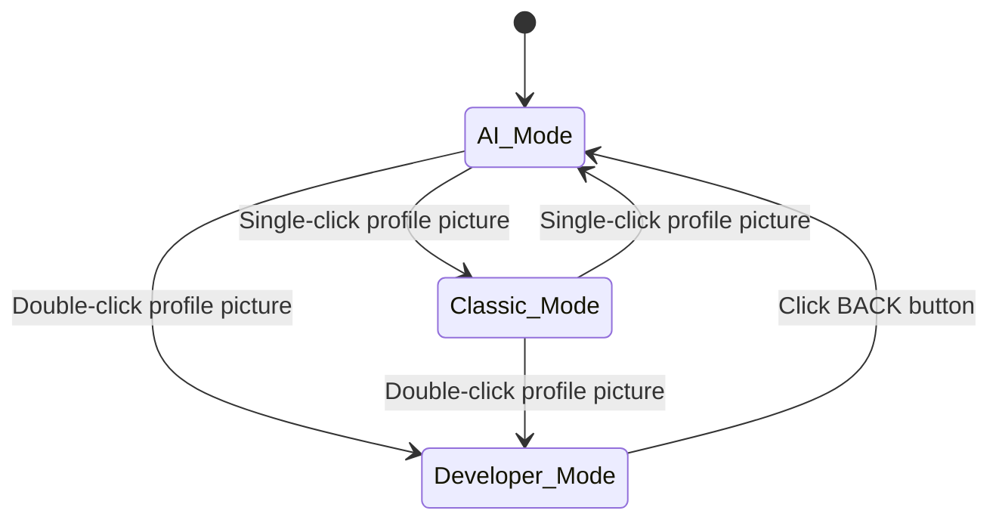
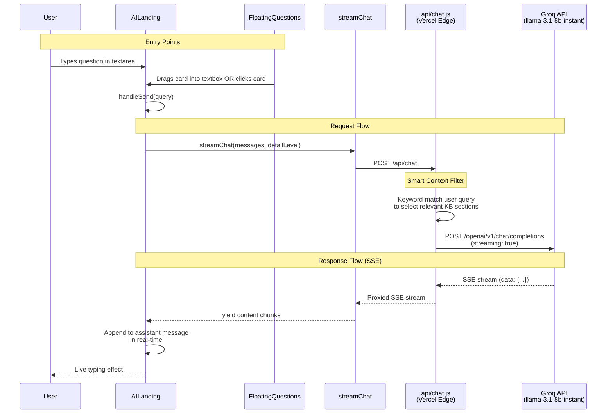
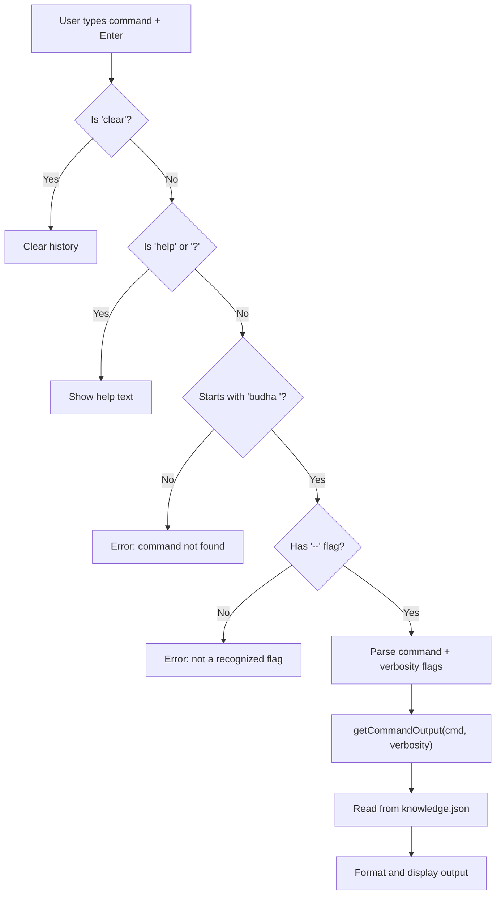

# Budhaditya Mukhopadhyay - Portfolio

An interactive, AI-powered portfolio built with **React + Vite + Tailwind CSS + Framer Motion**, deployed on **Vercel** with a serverless Edge Function backend.

The portfolio features three distinct viewing modes: an **AI Chat Interface**, a **Classic Portfolio**, and a hidden **Developer Terminal** accessible via an easter egg.

---

## Tech Stack

| Layer | Technology |
|---|---|
| **Frontend** | React 18, Vite 7, Tailwind CSS 3, Framer Motion 11 |
| **Backend** | Vercel Edge Functions (Serverless) |
| **LLM** | Groq API (`llama-3.1-8b-instant`) |
| **Deployment** | Vercel |
| **Analytics** | @vercel/analytics |

---

## Project Structure

```
PortfolioBM/
├── api/
│   └── chat.js                  # Vercel Edge Function (LLM proxy)
├── src/
│   ├── App.jsx                  # Root - mode routing (ai/classic/dev)
│   ├── main.jsx                 # Entry point
│   ├── components/
│   │   ├── AILanding.jsx        # AI chat interface + suggestion chips
│   │   ├── AIBackground.jsx     # Animated background for AI mode
│   │   ├── FloatingQuestions.jsx # Draggable question cards
│   │   ├── DevTerminal.jsx      # Developer Mode terminal emulator
│   │   ├── Hero.jsx             # Classic mode hero section
│   │   ├── Navbar.jsx           # Navigation bar (shared)
│   │   ├── About.jsx            # Classic mode about section
│   │   ├── Projects.jsx         # Classic mode projects section
│   │   ├── Skills.jsx           # Classic mode skills section
│   │   ├── PublishedPapers.jsx  # Classic mode papers section
│   │   ├── Contact.jsx          # Classic mode contact section
│   │   └── Footer.jsx           # Footer
│   ├── data/
│   │   └── knowledge.json       # Structured knowledge base (client-side)
│   ├── utils/
│   │   └── chat.js              # SSE stream reader (async generator)
│   └── styles/
│       └── index.css            # Global styles + CSS variables
├── public/
│   └── images/                  # Static assets
├── package.json
├── vite.config.js
├── tailwind.config.js
└── postcss.config.js
```

---

## Application Modes

The app is controlled by a single `mode` state in `App.jsx`, which can be `"ai"`, `"classic"`, or `"dev"`.



- **AI Mode** (`AILanding.jsx`): Default. Chat interface with LLM-powered responses.
- **Classic Mode** (`Hero.jsx` + sections): Traditional scrollable portfolio.
- **Developer Mode** (`DevTerminal.jsx`): Full terminal emulator, hidden easter egg.

---

## AI Chat Architecture

### End-to-End Flow



### 1. User Input (Client-Side)

There are **three ways** a user can initiate a chat:

| Method | Component | Mechanism |
|---|---|---|
| **Type + Enter** | `AILanding.jsx` | `textarea` → `handleSend()` |
| **Click suggestion chip** | `AILanding.jsx` | `onClick` → `handleSend(chip.query)` |
| **Drag floating question** | `FloatingQuestions.jsx` | `onDragEnd` checks if dropped inside `textboxRef` bounding rect → `onQuestionClick(question)` → `handleSend()` |

#### Floating Questions (Drag-and-Drop)

`FloatingQuestions.jsx` generates draggable question cards at startup:

1. Reads `knowledge.json` to build a pool of questions (general, per-company, per-degree, hobbies).
2. Shuffles and selects 5 random questions.
3. Positions them in safe zones (avoiding center profile area and bottom input).
4. Each card uses Framer Motion `drag` with `dragSnapToOrigin`.
5. On `onDragEnd`, checks if the drop point is inside the textarea's bounding rectangle.
6. If inside → triggers `onQuestionClick(question)` which calls `handleSend(question)`.

### 2. Detail Level Slider

A 5-level slider below the input controls response depth:

| Level | Temperature | Instruction |
|---|---|---|
| 1 | 0.1 | Single short sentence |
| 2 | 0.3 | 1-2 sentences |
| 3 (default) | 0.5 | Professional 2-3 sentences |
| 4 | 0.7 | Detailed with context |
| 5 | 0.8 | Comprehensive |

### 3. Client-Side Streaming (`src/utils/chat.js`)

`streamChat()` is an **async generator function**:

```
POST /api/chat
Content-Type: application/json

{
  "messages": [
    { "role": "user", "content": "Who is Budhaditya?" }
  ],
  "detailLevel": 3
}
```

- Reads the response body as a `ReadableStream`.
- Buffers partial chunks, splits on `\n`, and processes only complete `data: {...}` lines.
- Parses each SSE event as JSON, extracts `choices[0].delta.content`, and `yield`s it.
- On `data: [DONE]`, returns.

### 4. Serverless Edge Function (`api/chat.js`)

The backend runs as a **Vercel Edge Function** (`runtime: "edge"`):

#### Smart Context Filter

To minimize token usage, the function doesn't send the entire knowledge base. It performs **keyword matching** on the user's query:

| Keywords | KB Section Included |
|---|---|
| `hobb`, `photo`, `drone`, `flickr` | `personal` |
| `volks`, `vw`, `car` | Volkswagen experience |
| `vision`, `health`, `audio` | VisionHealth experience |
| `weevil`, `advisor` | Weevils Drones experience |
| `ovgu`, `university`, `study`, `degree` | `education` |
| `dzne`, `tongue`, `lip`, `als` | DZNE experience |
| `cognizant`, `ericsson`, `india` | Other experience |
| *(no match)* | Summarized career + general Q&A |

Always included: `identity` + `contact`.

#### Conversation Diet

Only the **last 4 messages** are sent to the LLM (plus system prompt), preventing token overflow in long conversations.

#### Groq API Request

```
POST https://api.groq.com/openai/v1/chat/completions
Authorization: Bearer $GROQ_API_KEY

{
  "model": "llama-3.1-8b-instant",
  "temperature": 0.5,       // varies by detailLevel
  "stream": true,
  "messages": [
    { "role": "system", "content": "..." },
    { "role": "user", "content": "Who is Budhaditya?" }
  ]
}
```

The system prompt embeds the filtered knowledge base and strict behavioral rules (no emojis, only answer from context, etc.).

#### Response

The Edge Function creates a `ReadableStream` that proxies the Groq SSE stream directly to the client.

### 5. Message Rendering

- User messages: Right-aligned blue bubbles.
- Assistant messages: Left-aligned glass-morphism bubbles with a `LVL:n` badge.
- During streaming, a `TypingIndicator` (bouncing dots) is shown inline.

---

## Developer Terminal Architecture

### Access

Double-click the profile picture in either AI or Classic mode. A timer-based click handler (`handleProfileClick`) in both `Hero.jsx` and `AILanding.jsx` differentiates:
- **Single click** (250ms timeout): Toggles AI/Classic mode.
- **Double click** (within 250ms): Sets `mode = "dev"`.

### Terminal Emulator (`DevTerminal.jsx`)

A full-featured terminal emulator with:

#### Visual Features

| Feature | Description |
|---|---|
| **ASCII Art Header** | "BM" logo + "BUDHADITYA" text with typewriter animation (~2s) |
| **Tagline** | "Budhaditya's Terminal / For the developers, by a developer." |
| **Custom Block Cursor** | Fat blinking cursor using Framer Motion `steps(2)` animation |
| **Theme Toggle** | Sun/Moon SVG icons for dark/light mode |
| **OS Toggle** | CMD/Ubuntu mode switch with contextual logo display |
| **Color Toggle** | White/Green text color options |
| **Fullscreen** | Native Fullscreen API toggle with SVG icons |

#### OS Themes

| Mode | Dark BG | Light Text Color |
|---|---|---|
| **CMD** | `#050505` | Green: `#15803d`, White: `#111827` |
| **Ubuntu** | `#300a24` (Burgundy) | Green: `#991b1b` (Dark Red), White: `#111827` |

#### Command System

All commands follow the pattern: `budha --<command> [--verbosity]`

```
Available commands:
  budha --about        budha --education    budha --experience
  budha --current      budha --skills       budha --hobbies
  budha --research     budha --contact      clear
  help                 ?

Verbosity Flags:
  --oneline            Brief summary
  --medium             Standard view (default)
  --detailed           Full details with descriptions
```

#### Data Source

The terminal reads directly from `src/data/knowledge.json` (same source as the floating questions). No API calls are made; all data is local.

#### Command Processing Flow



---

## Knowledge Base (`knowledge.json`)

A single JSON file that serves as the **source of truth** for both the AI chat and the Developer Terminal:

```json
{
  "identity": { "full_name", "title", "tagline", "bio" },
  "personal": { "hobbies": [...] },
  "contact": { "email", "linkedin", "github", "location" },
  "education": [...],
  "experience": [
    {
      "company": "...",
      "location": "...",
      "roles": [
        {
          "title": "...",
          "period": "...",
          "bullets": [...],
          "skills": [...]
        }
      ]
    }
  ],
  "research": [...],
  "general_questions": [...]
}
```

A **duplicate** of this knowledge base also exists inline in `api/chat.js` for the Edge Function's system prompt construction (since Edge Functions cannot import local JSON at runtime on Vercel).

---

## Easter Eggs

| Trigger | Action |
|---|---|
| **Single-click** profile picture | AI <-> Classic mode swap (with morphing animation) |
| **Double-click** profile picture | Enter Developer Terminal mode |

---

## Development

```bash
# Install dependencies
npm install

# Start dev server
npm run dev

# Build for production
npm run build
```

### Environment Variables (Vercel)

| Variable | Description |
|---|---|
| `GROQ_API_KEY` | API key for Groq LLM inference |

---

## Deployment

The project is deployed on **Vercel**. The `api/chat.js` file is automatically detected as a Vercel Edge Function.

```bash
git push origin main    # Auto-deploys via Vercel GitHub integration
```

---

Built with precision by Budhaditya Mukhopadhyay.